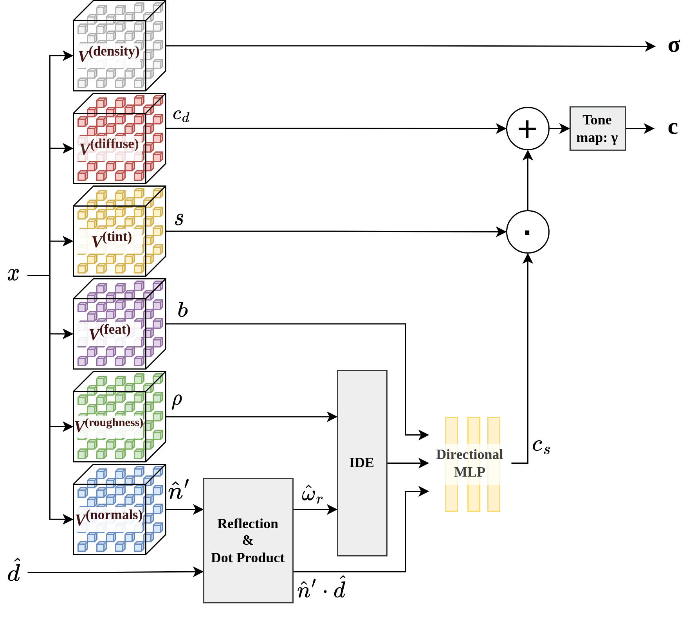

# ref-dvgo
## Reflection-Aware Direct Voxel Grid Optimization for an Improved Quality-Efficiency Trade-Off in Reflective Scene Reconstruction
Source code of the paper titled "Reflection-Aware Direct Voxel Grid Optimization for an Improved Quality-Efficiency Trade-Off in Reflective Scene Reconstruction", to be presented at the TRICKY workshop of ICCV 2023.



## Installation
Simply run `$ bash install_env.sh`  to install the conda environment that is required to run the code.

## Datasets
This codebase is evaluated on two datasets that you can download from the links below:
- [ref-shiny](https://storage.googleapis.com/gresearch/refraw360/ref.zip)
- [smart-car](https://drive.google.com/file/d/16BDhyQJP4mcmFWaJoBBnvyMa1I3lr59o/view?usp=drive_link)

All the scripts assume that the datasets are located in a directory called *data/* at the root of the repository.

## Training
To train a model on a specific scene e.g. the car scene from the blender shiny dataset use the following command:
```shell
$ bash train.py ref_shiny/car <JOBID> <Optional ARGS>
```
You can provide command line arguments that overwrite the config file arguments like below:

```shell
$ bash train.py ref_shiny/car 12345 fine_train.N_rand=4096 fine_train.N_iters=80000
```

Training with the default configuration takes around 30 minutes on average on an Nvidia TITAN V.


## Acknowledgements
We gratefully acknowledge funding support from the Sim2Real2 project, in the context of the Ford-KU Leuven alliance program.

This codebase is heavily based on [dvgo](https://github.com/sunset1995/DirectVoxGO), [multinerf](https://github.com/google-research/multinerf), and [refnerf-pytorch](https://github.com/gkouros/refnerf-pytorch).

## Citation

```latex
@inproceedings{kouros2023refdvgo,
author    = {Georgios Kouros and Minye Wu and Sushruth Nagesh and Shubham Shrivastava and Punarjay Chakravarty and Tinne Tuytelaars},
title     = {Reflection-Aware Direct Voxel Grid Optimization for an Improved Quality-Efficiency Trade-Off in Reflective Scene Reconstruction},
year      = {2023},
url       = {https://github.com/gkouros/ref-dvgo}
}
```